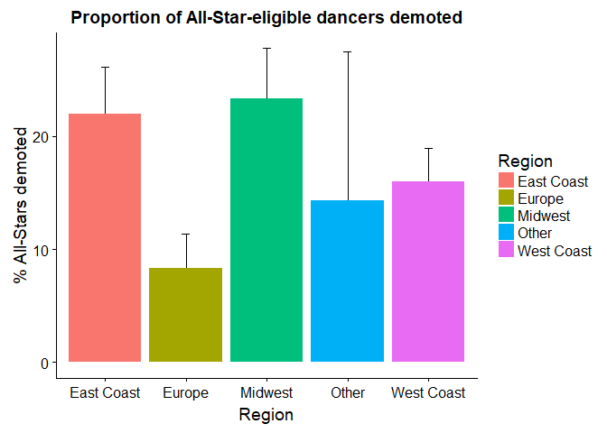
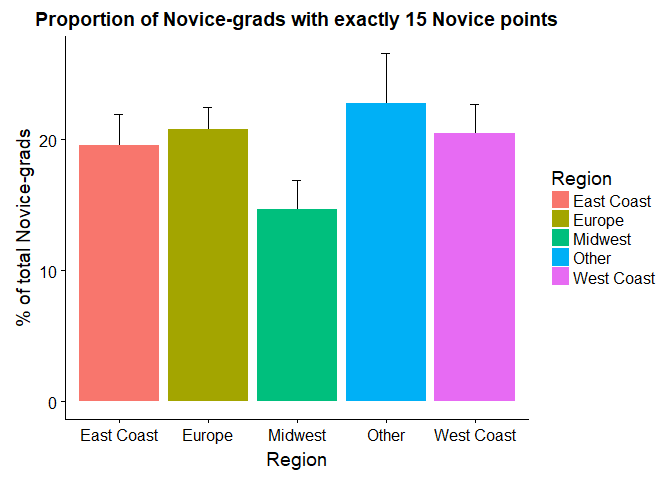
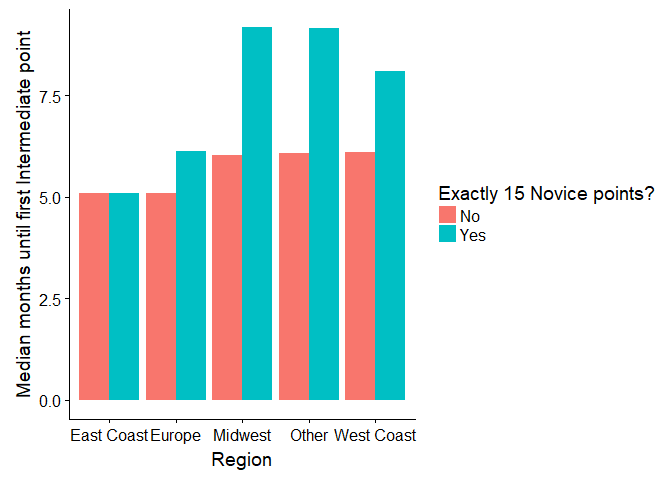
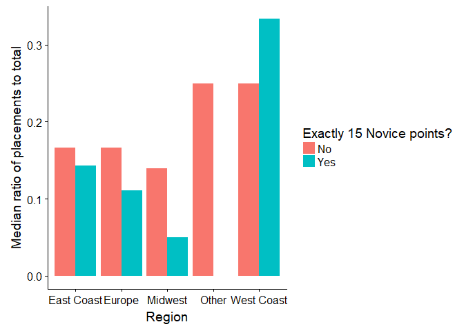
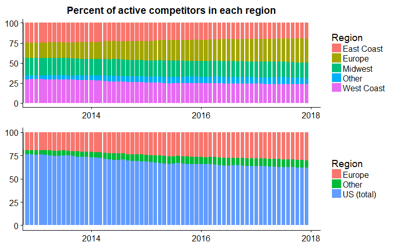
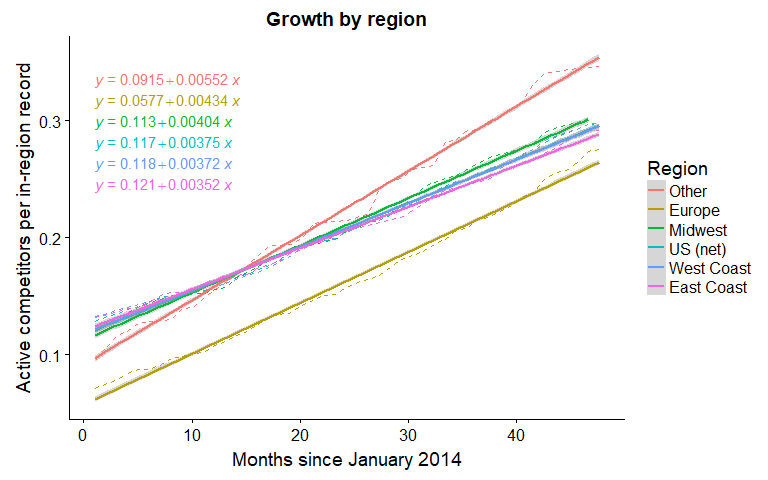

**Introduction**
----------------

Saying that West Coast Swing is my primary hobby might be an
understatement at this point -- I dance one or two nights a week, attend
a convention about once a month, and practice... maybe not as often as I
should, but sometimes. Many of my friends are ones I met through dance,
and sometimes we talk about West Coast Swing even when we're not
dancing. Suffice it to say, I end up thinking about this dance a lot (I
know, I'm really cool).

In my 4 years of dancing, I've often had passing wonderings about
various aspects of the dance. Luckily, the World Swing Dance Council
(WSDC) tracks competition results for West Coast Swing, so there's
plenty of data to play with -- conveniently, that makes good practice
material for my learning and exploration in the world of data science.
There are too many of these questions to cover in one post (...and I
don't know how to do everything I want to do yet), but here's the first
installment! It's mostly inspired by discussions around the rule changes
that take effect in 2018.

As an aside: I'm pretty new to this, so I'm sure this is incredibly
poorly-written code. I was pretty hesitant to make this post at all, but
the topic is sort of timely, and I can't improve if I don't put myself
out there, right? So if you are a computery person who is feeling
generous, I would love if you could take a look and help me destupidify
my code (Python and R both)! [You can find all files used (including the
version of this page that doesn't hide code chunks)
here](https://github.com/conniewang3/WSDC-Project/tree/master/part1).
Shoot me a message -- I'd be happy to buy you lunch/coffee for your
help, or skilltrade a dance lesson or something.

**TL;DR**
---------

(AKA the part where I practice Tableau dashboarding -- try hovering and
clicking on things!)
<iframe src="https://public.tableau.com/views/WSDCProjectPart1/TLDR?:embed=y&:display_count=yes&publish=yes&:toolbar=no&:showVizHome=no"
 width="810" height="1240" frameBorder="0"></iframe>

### **West Coast Swing**

#### (A brief primer for anyone reading this who's not already familiar with West Coast Swing)

West Coast Swing (WCS) is a versatile partner dance that emphasizes,
among other things, the ability to create a dance with a partner on the
spot. There is a competitive aspect of this dance which tests this
ability; it involves going to weekend-long events and participating in
Jack & Jills, the main competition format. In a Jack & Jill prelim
round, each competitor dances 3 times, each time with a different random
partner to a random song. Judges then select their favorite dancers to
move on to finals, where competitors are again randomly paired and
receive a placement depending on how well the judges score each
partnership. Points are assigned if you final or place according to the
WSDC rules, and tracked on the WSDC database. There are 4 main
competition divisions: Novice, Intermediate, Advanced, and All-Star --
to move up to a higher division, a competitor must earn a certain number
of points in their division. [The rules for this are outlined
here.](github.com/conniewang3/WSDC-Project/blob/master/files/rules_new.pdf)

### **Motivation**

Recently, there was a change in the rules, which has sparked a lot of
discussion especially among more isolated communities, like Asia and
Australia. Although Europe and the US now have many WCS events per year,
Asia and Australia are still smaller WCS scenes. The lack of local
events and expense of traveling to the established, larger, and distant
events in the US and Europe make it significantly more difficult for
dancers in this scene to move up through the divisions. The rule change
is perceived as making it even more difficult (or perhaps even
impossible) for these dancers. Many of the questions here were inspired
by the discussion around this change. [The new version of the rules can
be found
here.](github.com/conniewang3/WSDC-Project/blob/master/files/rules_new.pdf)

**Results**
-----------

### **Impact of change in All-Star requirements**

Under the old rules, anyone with 45+ Advanced points within the last 3
years or 1+ All-Star points ever is eligible to compete in All-Star.
Starting 2018, anyone with 45+ Advanced points or 3+ All-Star points in
the last 3 years is eligible. This means that dancers with 1+ All-Star
point ever but less than 3 All-Star points and less than 45 Advanced
points in the last 3 years are "demoted" back to Advanced. How many
active competitors will that affect?

I'll define "active" competitors in this post as having gotten a point
in any division from Novice to All-Star within the last 3 years. I can
think of a handful of dancers who still travel and compete in All-Star,
but haven't gotten a point in several years; however, I'm guessing there
are fewer of these than dancers who haven't gotten a point in 3 years
because they stopped competing.

#### **How many All-Star dancers will be demoted?**

A total of **76** dancers currently competiting in All-Star will need to
compete in Advanced starting in 2018 (unless they successfully
petition).

As All-Star is an opt-in division, I counted only those with All-Star
points as "All-Star" in my dataset. The demoted dancers represent
**18%** of these dancers.

Those with at 45+ Advanced points in the last 3 years but 0 All-Star
points can choose whether they want to compete in Advanced or All-Star
-- there are **54** of these dancers and they constitute **11%** of all
those eligible to compete in All-Stars. The demoted dancers represent
**16%** of All-Star-*eligible* dancers.

As regional variation is kind of the theme of this post, I broke down
the percentage of All-Star-eligible dancers who will be demoted by
region. Note that WSDC doesn't keep data on where each dancer lives, so
region data was inferred based on what events the dancer earned points
at. Midwest includes Texas, Europe includes Israel, and Other is
Asia/Australia/NZ/Brazil (more details at the bottom if you're
interested).

 There
is definitely some regional variation here -- it looks like a relatively
larger portion of current All-Stars will be demoted in the East Coast
and Midwest regions (error bars show standard error).

Since repeated two-way tests would overestimate significance, I used
Fisher's exact test to measure independence of the two variables
instead. The p-value from this test indicates a 99.94% confidence that
the the two variables are not independent (or, to be more technically
correct, that there's a 0.06% chance we'd see these results or more
extreme if there were no difference in population means -- take that,
pedantic naysayers). In other words, we can say with
statistically-backed conviction that **the percentage of
All-Star-eligible dancers who will be demoted is different in different
regions.**

### **Impact of change in required number of Novice points (from 15 to 16 points)**

Under the old rules, dancers with 15+ Novice points must compete in
Intermediate. With the rule change, dancers with 16+ Novice points are
eligible for Intermediate, and dancers with 30+ Novice points must
compete in Intermediate. To understand the impact of this rule change, I
wanted to find out:

1.  How many dancers will be "demoted" by the change? How many dancers
    will be allowed to return to Novice as a result of the change?
2.  Do dancers with exactly 15 Novice points do worse in Intermediate
    than those with more than 15?

To answer these questions, I looked at only dancers who pointed out of
Novice after February 2015 (when the old rules took effect). I wasn't
able to find copies of the old rules so I don't know when exactly the
point requirement became 15 -- if you have this information, I'd love to
know!

#### **How many dancers will be "demoted" and how many can now choose to dance down?**

Of people who were previously competing in Intermediate, **157** now
*must* compete in Novice, and **667** now *have the option* to compete
in Novice. This represents **9%** and **36%** of current Novice dancers
or **12%** and **50%** of current Intermediate dancers.

I'm pretty surprised by how high these numbers are, actually. I wonder
how many of these dancers are actually in the presumed target group of
dancers who compete only once in Novice... (quiet sounds of
number-crunching in the background)

Wow, I totally overestimated the number of Novice dancers who got their
15 points exactly all in one go. I really thought the change from 15 to
16 points was targeted at dancers who get one lucky draw at a tier 3
comp, place 1st, and are immediately out. Turns out, that's only **22%**
of total affected dancers (those with exactly 15 Novice points and 0
Intermediate points). In fact, the average affected dancer has competed
**4** times in Novice! Actually, now that I think about it, this makes
sense -- most Novice dancers who get out via a small number of
placements vs. one point at a time will overshoot 15.

Now let's break down of the number of 15-point-Novice-graduates in each
region, taken as a percentage of total Novice grads. This is meant to
give a measure of how much the rule change will impact each region going
forward.

    ## # A tibble: 5 x 2
    ##       region   avg
    ##        <chr> <dbl>
    ## 1 East Coast  4.28
    ## 2     Europe  4.15
    ## 3    Midwest  4.21
    ## 4      Other  3.56
    ## 5 West Coast  3.74

It seems that the Midwest has a relatively lower proportion of dancers
who escape Novice with 15 points exactly. When we Fisher test as we did
in the previous section, we get a p-value of 0.036 -- this suggests a
96% confidence that **your likelihood to hit exactly 15 Novice points
(and thereby be affected by the new Novice requirement) varies based on
where you live.**

I'm kind of surprised, honestly. As for interpretation -- dancers in the
Midwest go to fewer tier 3 Novice divisions maybe? A tier 3 Novice
division gives out a single point more frequently than tier 2 (where
only 5th-10th get a single point) and tier 1 (where only 5th place gets
a single point), and is also the only way to get 15 points in one go.
That's about all I can think of.

For good measure, I also broke down the mean number of Novice events for
15-point-Novices by region. It's about the same across regions: 4-ish
events.

#### **How well do 15-point Novice dancers do in Intermediate?**

I decided to use two metrics for how "ready" a Novice dancer is for
Intermediate. The first is **time to first Intermediate point**. It
would be better to use number of competitions until first Intermediate
point, but since the WSDC doesn't record points from competitions that
dancers participate in but don't point at, I don't have access to this
information. Additionally, I wanted to include dancers who don't yet
have an Intermediate point (to catch dancers who have been competing in
Intermediate but haven't gotten a point yet). To use that data, I
pretended that these dancers will get their first point in January 2018.

The downside of using time rather then number of competitions is that it
penalizes those who don't compete often. As a second metric robust to
this bias, I looked at **ratio of placements to total** in Intermediate,
with the logic that dancers who get most of their points from placing
rather than making it to finals (but not placing) are better dancers
compared to the rest of their division. Looking at just the number of
placements wouldn't distinguish between placing at a tier 1 event and
placing at a tier 3 event -- so, I chose to count entries with more than
5 points awarded -- this corresponds with 1st to 5th place at a tier 3
event or 1st to 3rd place at a tier 2 event. Of course, due to the
nature of this dance/competition format, doing well in finals vs.
prelims is not necessarily a measure of how good a dancer you are.
Choosing good metrics is hard :(

I also broke down results by region, to account for any variation there.

    ##   15 Points  16+ Points     p-value 
    ## 7.133333333 5.100000000 0.007491008

Because the medians of each region are comparable to each other, I
decided to look at combined data from all the regions. Across regions,
we find 99% confidence that dancers with exactly 15 Novice points **take
longer on average to get their first Intermediate point**.

On the other hand, the difference in medians is only about 2 months, so
how much does that really matter?

\[Stats note: quick histograms of the data (not shown) revealed it's
pretty skewed across all regions, hence I've used medians and
nonparametric hypothesis testing\]

    ## $`East Coast`
    ## [1] 0.6172493
    ## 
    ## $Europe
    ## [1] 0.3063432
    ## 
    ## $Midwest
    ## [1] 0.6110595
    ## 
    ## $Other
    ## [1] 0.004803169
    ## 
    ## $`West Coast`
    ## [1] 0.3791493

Well, it looks like the low incidence of placing 1st-5th at a tier 3 or
1st-3rd at a tier 2 has maybe come back to bite us -- this data is
decidedly not as pretty.

Significance testing by region, we see that dancers in the Other region
(Asia/Australia/Brazil) with exactly 15 Novice points **place less
frequently in Intermediate**. The is also the trend in 3 of the other 4
regions (East Coast, Europe, Midwest), although the differences there
are not significant.

Combining the two metrics, there is some evidence that Novice dancers
with exactly 15 points do slightly worse in Intermediate than those with
more than 15 points. Although it's not a large difference, and changing
the requirement from 15 to 16 points is unlikely to do much, this does
justify the rule change somewhat.

### **Community growth in the US and overseas**

One question that's come up in the discussions surrounding the rule
changes is whether the decisions were made in a US-centric way by a
board that contains only members who live in the US/don't travel enough.
The argument has been made that West Coast Swing has grown into an
international dance, and that the WSDC board should have more
international representation. I tried to use WSDC data to see just how
international the dance has become/is becoming.

#### **Percentage of active competitors by region**

The most direct way to look at growth is to see what percentage of
active competitors (at least 1 point in the last 2 years) live in each
region. I'm about 90% sure that I did this in the stupidest possible
way, but hey, the plots work so I think that deserves partial credit.

The share of competitors living in each of the 3 regions of the US (East
Coast, Midwest, West Coast) has shrunk slightly since 2013, while the
proportions living in Europe and Asia/Australia/Brazil (Other) have both
increased.

Bundling all of the US regions into one, it becomes clearer that
international competitors have been quite a large portion of the total
for some time, and that this fraction continues to grow. International
competitors have comprised **over 30%** of the total since mid-2014
(over 3 years ago!), and currently represent **38%** of all competitors.
By this measure, international representation on the WSDC board
certainly seems overdue.

#### **Growth rate of number of dancers by region**

In trying to write this, I discovered that it's more difficult than I
thought to estimate the absolute number of dancers in a region from the
points registry data (which can only give you the number of pointed
competitors). The main problem is that the number of pointed competitors
in a region depends both on how many dancers there are *and* how many
times points were awarded in that region(i.e., how many events and what
tier the events are).

I decided to total the number of times a point was awarded by an event
in each region in 2014-2018 (using eventregions.py) and divide the
number of competitors by that quantity. This is used as a proxy that
depends much less on number of events and size of events in the region.

(Dotted line shows actual data; solid line shows linear fit. By
"in-region record", I mean "instance where an event in that region
awarded points to someone in 2014-2018")

I think the closest I can come to intuiting the value being plotted is
to think about it as a ratio of the number of competitors to the number
of events (weighted by event size, since tier 3 events give points to
more people than tier 2 events and so on) in a region. A higher value
indicates 1) the dancers in that region earn points outside of their own
region more frequently and 2) the events in that region award points to
more new dancers (as opposed to dancers who already have a WSDC number).

The growth rate of this value should be a pretty good descriptor of the
growth rate of each dance community, so here they are from highest to
lowest:

-   Other: 0.00552 \[competitors/record/month, not that this unit means
    much\]
-   Europe: 0.00434
-   Midwest: 0.00404
-   US (net): 0.00375
-   West Coast: 0.00372
-   East Coast: 0.00352

The estimated growth rate in Asia/Australia/Brazil is about 47% higher
than that of the US, and Europe is growing about 16% faster than the US.
The takeaway is that international representation on WCS decision-making
boards will be even more important as time goes on.

**Dataset**
-----------

Data was scraped from the WSDC website and processed by wsdcscraper.py.
The Python code generates a .csv file, which was then read into R for
the rest of the analysis. Only data from dancers with at least 1 Novice
point were collected.

### **Variables**

-   id: WSDC ID number
-   role: Primary role (leader/follower)
-   region: Estimated region of residence
-   end\_date: Date of most recent point entered
-   nov\_points: Number of points in Novice
-   nov\_start: Date of first Novice point
-   nov\_end: Date of last Novice point
-   nov\_count: Number of events with Novice points recorded
-   nov\_place: Number of (1-5) placements in Novice
-   nov\_first: Indicates whether placed first in Novice

The last 6 variables are duplicated for Intermediate (int), Advanced
(adv), and All-Star (als).

### **Regions**

Since regional differences were a common theme in the discussions, I
tried to estimate what region each dancer lives in by looking at where
the events that they pointed at are located (the logic is that people
will mostly travel to and get points from events close to them). Here
are the region definitions:

-   West Coast: West Coast US plus British Columbia
-   Midwest+TX: Midwest US
-   East Coast: East Coast US plus the rest of Canada
-   Other: Singapore, South Korea, Australia, New Zealand, Brazil
-   Europe: All else (...including Russia and Israel\*)

For dancers in the US and Canada, I used whichever region they had the
most events in. Since dancers from Europe or isolated communities often
travel to other regions to compete, I defined those differently. Any
dancer with more than 5 European events or at least 1 European event and
less than 10 events total was identified as a European dancer. Any
dancer with more than 3 events in an isolated region or at least 1 such
event and less than 10 events total was identified as the "other"
region. These estimations are, of course, not perfect, but a quick spot
check of dancers I know deem them to be good enough for me! It looks
like the largest bias is towards being identified as a "West Coast"
dancer if you live in the Midwest/TX, since there are relatively fewer
events in that region and it's a relatively short flight to the West
Coast, where there are more/larger events.

\*One thing I'm not sure about -- should Russia and Israel count as
Europe? I wanted to separate out Brazil, Asia, and Australia because of
discussions after the recent rule change about how these communities are
more isolated, as it's more expensive to travel from there to the rest
of the world and the local WSDC scene is not yet robust. I feel like
Russia and Israel are not quite so isolated but I'm not 100% sure --
anyone have input on this?
